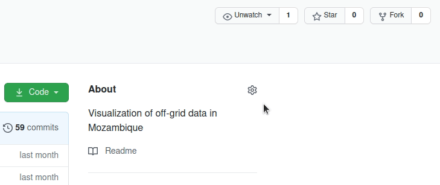
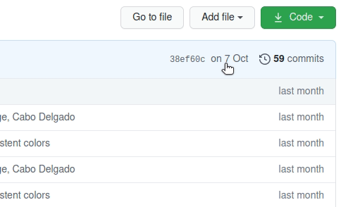
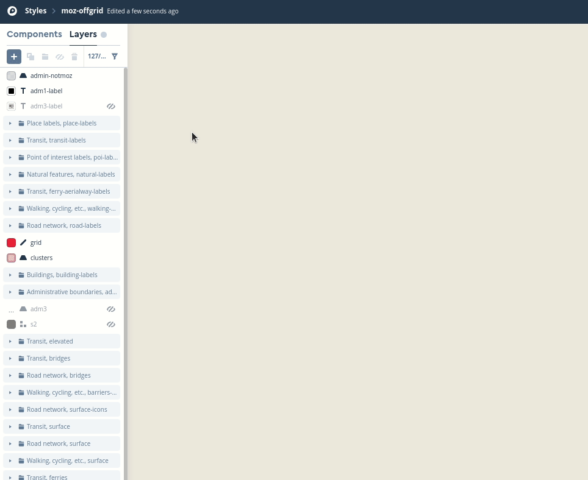
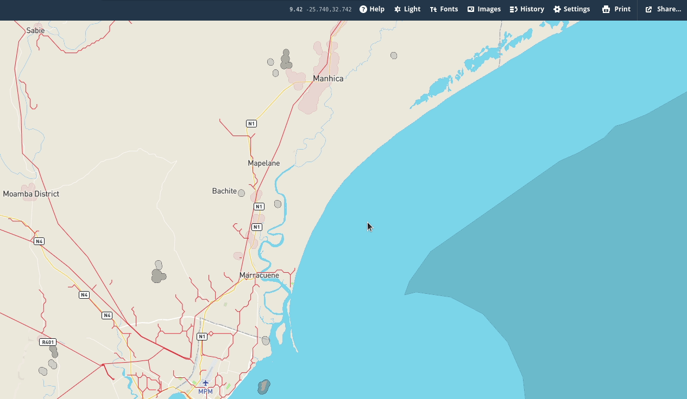
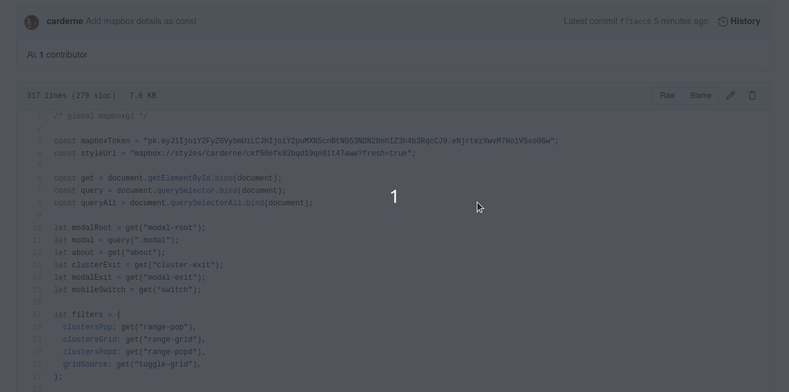

# Instructions to replicate this tool

## Create accounts
Sign up for accounts with:
- [GitHub](https://github.com/)
- [Netlify](https://www.netlify.com/)
- [Mapbox](https://account.mapbox.com/auth/signup/)

## Fork GitHub repository
Fork [this repository](https://account.mapbox.com/auth/signup/) (the one you're looking at).

You'll now have an exact copy within your account, e.g: `github.com/username/moz-offgrid-viz`.
Make sure to download it to your computer and unzip it.

## Copy Mapbox data
Go to [Mapbox Studio](https://studio.mapbox.com/tilesets/) and log in if needed. Click `Tilesets` in the top right.
There are eight datasets to upload. For each one, click `New tileset`, then choose the file, then click `Confirm` and it will start processing in the background.
Do this process for the following files (pay attention to the file extensions), all located inside the `data` folder of the repository:
- `s2_mosaic.mbtiles`
- `grid.mbtiles`
- `clusters.mbtiles`
- `adm3.mbtiles`
- `adm3_centroids.geojson`
- `adm2_centroids.geojson`
- `adm1_centroids.geojson`
- `moz-neg.geojson`

This could take more than 30 minutes!

## Copy Mapbox data and styles
Go to [this link](https://studio.mapbox.com/styles/add-style/carderne/ckf56efk02bqd19qn0lt47awe/), which will load the style into your Mapbox account (log in if needed).
It might display some error messages, but you can ignore these. Don't worry if the map looks blank when it's loaded.
You need to one-by-one connect the map layers to the data sources that you just uploaded.

Use the following table to choose the correct data source for each layer.
You can ignore the codes that follow each source name (e.g. `-bp8e2w`).
If any layer names change as you do this (e.g. `grid (1)`), make sure to change the back to the names as in this table!

| Layer           | Source              |
| --------------- | ------------------- |
| `admin-notmoz`  | `moz-neg`           |
| `adm1-label`    | `adm1_centroids`    |
| `adm3-label`    | `adm3_centroids`    |
| `grid`          | `grid`              |
| `clusters`      | `clusters`          |
| `adm3`          | `adm3`              |
| `s2`            | `s2_mosaic`         |

Once you're done, make sure to click `Publish` in the top right of the screen.

## Connect app to Mapbox
First get the details of the style you've created. Still within the editing window of Mapbox Studio, click `Share` in the top right.
Then copy the 'Style URL' and 'Access token' and paste them in a text file somewhere.

Now you need to edit [main.js](main.js) so that it points to your new Mapbox account.
To do so, please use a browser to go to the GitHub repository that you forked and click on `main.js` in the file list.
Then click the edit icon in the top right area, and paste the Mapbox values between the quotes on lines 3 and 4.

Then scroll to the bottom and click `Commit changes`.

## Display the app using Netlify
Go to [Netlify](https://app.netlify.com/) and log in if needed.
Click `New site from Git` and choose `GitHub` from the menu.
This will popup a dialog where you need to sign into your GitHub and approve any permission requests.
Then choose the repository `moz-offgrid-viz` from the list.
And on the next page click `Deploy site`.

After a few seconds, the site will have deployed, and you'll get a URL where you can visit it.
The URL will look something like `https://two-words-c870fs.netlify.app`.
You can change it by clicking `Site settings` and then `Change site name`.
Note it will still always end with `.netlify.app` unless you set up a custom domain.

## You're done!
